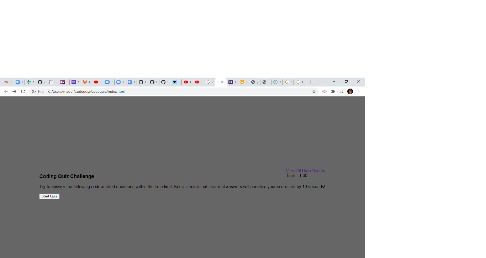
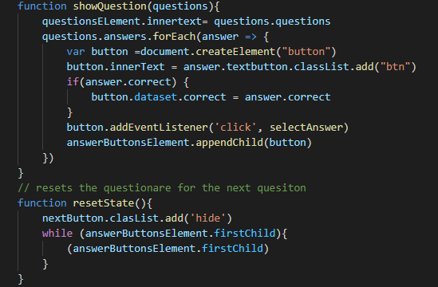
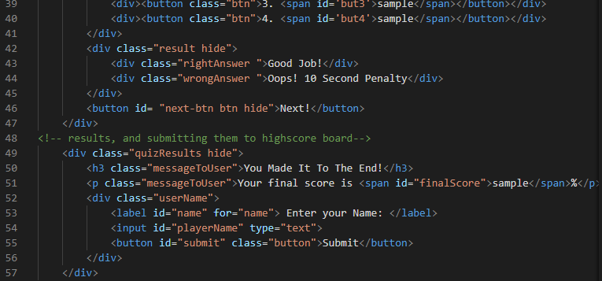

# codequiz
CodeQuiz!

in this assignment the goal was to make a code quiz using HTML, JavaScript, and CSS. 

The assignment required the use of JS to run a timer limiting the amount of time to answer the questions. The user answers questions and the application will prompt with a correct/incorrect evaluation of the answer. An incorrect response will cause a 10 second penalty against the timer.

I used a series of divs and called them 'windows' which will alternately be displayed and hidden depending on the progress of play allowing the application to be one html document.

The game ends when either all the questions are answered or when the timer runs down to zero. The application will then prompt for the player to input a name and display their score.

I found the Java script very challenging in this. The function for the timer and the questions was the most difficult for me. 

Deployed GitHub Repository
https://maddisontaitano.github.io/codequiz/

